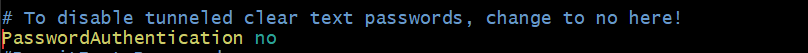

# 1st Cloud Assignment

Your login name: altschool i.e., home directory /home/altschool. The home directory contains the following sub-directories: code, tests, personal, misc Unless otherwise specified, you are running commands from the home directory.

#### Questions
1. Change directory to the tests directory using absolute pathname
1. Change directory to the tests directory using relative pathname
1. Use echo command to create a file named fileA with text content ‘Hello A’ in the misc directory
1. Create an empty file named fileB in the misc directory. Populate the file with a dummy content afterwards
1. Copy contents of fileA into fileC
1. Move contents of fileB into fileD
1. Create a tar archive called misc.tar for the contents of misc directory
1. Compress the tar archive to create a misc.tar.gz file
1. Create a user and force the user to change his/her password upon login
1. Lock a users password
1. Create a user with no login shell
1. Disable password based authentication for ssh
1. Disable root login for ssh

**Answers**

**Your login name: altschool i.e., home directory /home/altschool.**
**The home directory contains the following sub-directories: code, tests, personal, misc Unless otherwise specified**

```
sudo useradd - m -s/usr/bin/bash Altschool 
sudo passwd Altschool
sudo usermod -aG sudo Altschool
su Altschool
pwd
mkdir code tests personal miscs
ls
```


**you are running commands from the home directory.**
```
echo $HOME
ls
```

- Change directory to the tests directory using absolute pathname
```
cd /home/Altschool/tests
```


- Change directory to the tests directory using relative pathname
```
cd tests
```


- Use echo command to create a file named fileA with text content ‘Hello A’ in the misc directory
```
echo 'Hello A' > miscs/fileA
```


- Create an empty file named fileB in the misc directory. Populate the file with a dummy content afterwards
```
touch miscs/fileB to create the fileB then use vi editor to put dummy content vi fileB.

press i to insert and type the dummy content (mezikko is a baller) then after press escape and put :wq and click enter.

cat fileB shows up mezikko is a baller.
```


- Copy contents of fileA into fileC
```
cp fileA fileC
```


- Move contents of fileB into fileD
```
mv fileB fileD
```


- Create a tar archive called misc.tar for the contents of misc directory
```
tar -cvf misc.tar 
```


- Compress the tar archive to create a misc.tar.gz file
```
gzip misc.tar
```


- Create a user and force the user to change his/her password upon login
```
sudo useradd lewinski
add pasword sudo passwd lewinski
enforce passwd change
sudo chage -d 0 lewinski
```


- Lock a users password
```
sudo passwd -l lewinski 
to unlock it, you use -u
```


- Create a user with no login shell
```
sudo useradd -s /usr/sbin/nologin chinaza
```


- Disable password based authentication for ssh
```
sudo vi /etc/ssh/sshd-config
```



-  Disable root login for ssh
```
sudo vi /etc/ssh/sshd-config
```


